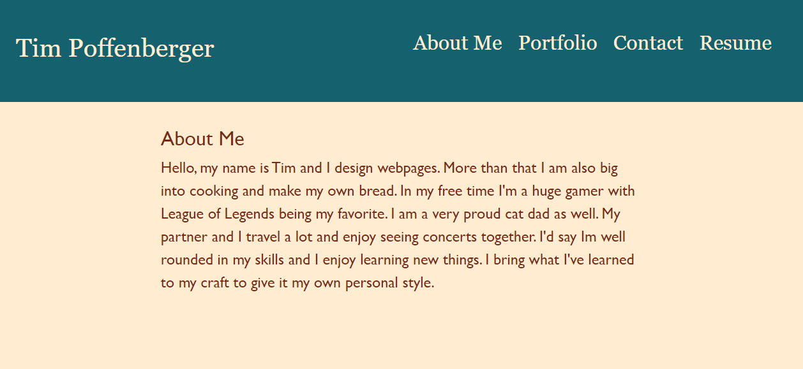

# React Portfolio

## Description

This app was created to serve as my personal portfolio. Building it was great way to deepen my knowledge of and practice React and react-bootstrap. It conatins a brief "About Me" section, and "Portfolio" section that lists some of my previous projects, a "Contact" section that allows you to send me an email directly (functionality not yet implemented), and a "Resume" section that has a downloadable version of my resume (functionality not yet implemented) as well as a list of technologies I have varying levels of experience with. The footer at the bottom contains links to my personal Github and LinkdIn pages.

## Usage

This webpage can be accessed by going to [this link.](https://main--hilarious-torte-26d0ae.netlify.app/portfolio) Click on the different sections listed in the header to navigate to the different pages that are available. 

